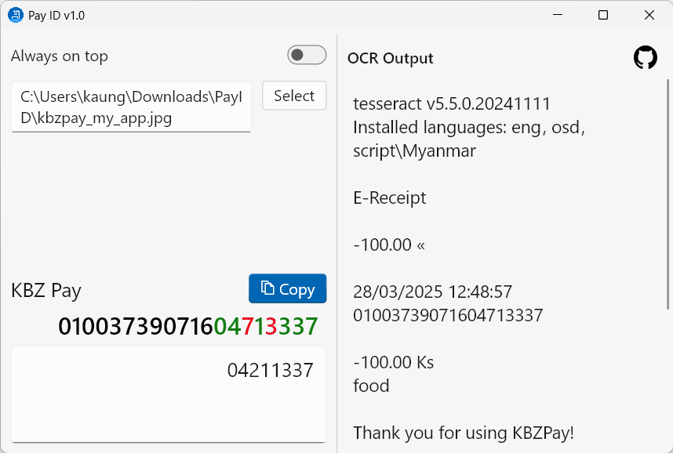

# PayID

A simple app to extract Transaction ID from the receipt image of KBZ Pay and Wave Pay.


> [!NOTE]\
> App requires [Tesseract CLI](https://github.com/tesseract-ocr/tesseract) to be installed.



https://github.com/user-attachments/assets/c723d015-210e-447c-b53c-9056a79f35a5

## Download

<https://github.com/kaungkhantjc/PayID/releases>

## Tesseract CLI installation

- For Windows

  Download .exe file from [tesseract releases](https://github.com/tesseract-ocr/tesseract/releases)
  page and run.
  Install **additional script data > Myanmar script** and **additional language data > Burmese**
  while setup.

- For Mac

    ```shell
    brew install tesseract tesseract-lang
  ```

- For Ubuntu

  ```shell
  sudo apt update
  sudo apt install tesseract-ocr tesseract-ocr-mya
  ```

- For others

  <https://tesseract-ocr.github.io/tessdoc/Installation.html>

## Contributing

I'd love to accept your patches and contributions to this project. All submissions, including
submissions by project members, require review. I use GitHub pull requests for this purpose. Consult
GitHub Help for more information on using pull requests.

Please perform a quick search to check if there are already existing issues or pull requests related
to your contribution.

## License

PayID is released under the Apache 2.0 license.

    Copyright 2025-present PayID Contributors

    Licensed under the Apache License, Version 2.0 (the "License");
    you may not use this file except in compliance with the License.
    You may obtain a copy of the License at

        http://www.apache.org/licenses/LICENSE-2.0

    Unless required by applicable law or agreed to in writing, software
    distributed under the License is distributed on an "AS IS" BASIS,
    WITHOUT WARRANTIES OR CONDITIONS OF ANY KIND, either express or implied.
    See the License for the specific language governing permissions and
    limitations under the License.
